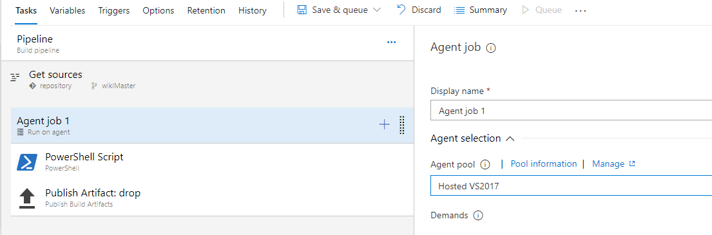
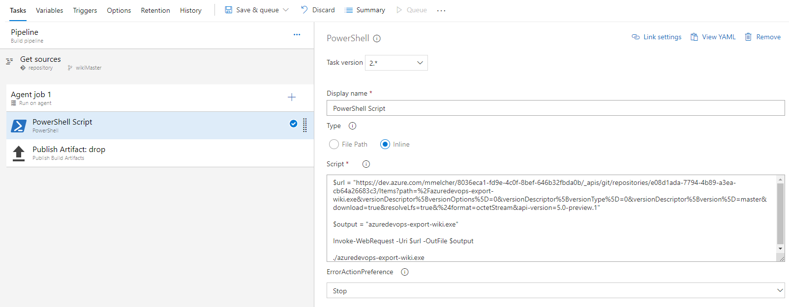
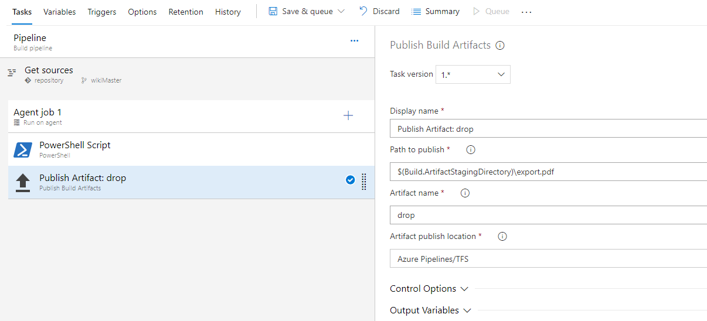

Please use the Azure DevOps Extension by @rfennell if possible:
https://marketplace.visualstudio.com/items?itemName=richardfennellBM.BM-VSTS-WikiPDFExport-Tasks


Using Azure DevOps WikiPDFExport as build task is straightforward.

1. Create a new build definition
1. Git Source is "Other Git"
1. 1. Add the clone url to the wiki to the details and username / password if required
1. Ensure that the agent is a windows agent
1. Add a powershell task with the following code:

```
#Download url to the export tool
#!!! Update the url to the latest version!!!
$url = "https://github.com/MaxMelcher/AzureDevOps.WikiPDFExport/releases/download/v3.0.0/azuredevops-export-wiki.exe"

#filename of the tool
$output = "azuredevops-export-wiki.exe"

#download the file
Invoke-WebRequest -Uri $url -OutFile $output

#launch the tool - adjust the parameters if required
./azuredevops-export-wiki.exe
```

5. Add a second task to publish the PDF as build artifact.

Once the build succeeds, you can download the PDF file from the build page or use it in a release.

## Pictures

### Windows Agent
 

### PowerShell Task


### Publish Task

