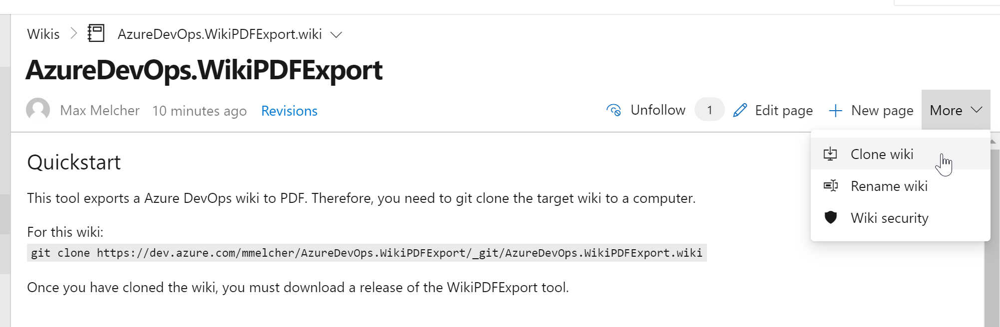
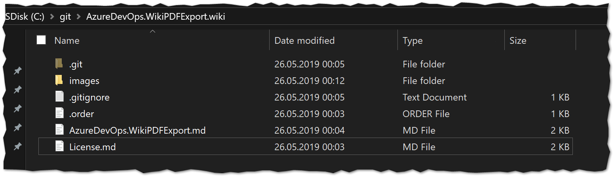

## 🏎 Quickstart
This tool exports an Azure DevOps wiki as PDF. Therefore, you need to git clone the target wiki to a computer. You can get the clone link of the wiki in the top right of the wiki homepage:


To clone this wiki, use the following command:
`git clone https://dev.azure.com/mmelcher/AzureDevOps.WikiPDFExport/_git/AzureDevOps.WikiPDFExport.wiki`

The result should look like this: 

 
Once you have cloned the wiki, you must download the Azure DevOps WikiPDFExport tool.
**[azuredevops-export-wiki.exe](https://github.com/MaxMelcher/AzureDevOps.WikiPDFExport/releases)** (~30MB)

You can drop it right into the cloned folder and execute it there. 
Launched without parameters, the tool will detect all wiki files next to it and convert it to a PDF called export.pdf right next to it. Similar to this [pdf](https://github.com/MaxMelcher/AzureDevOps.WikiPDFExport/blob/main/AzureDevOps.WikiPDFExport/export.pdf).

If you need more control over the output, please see the Configuration Options below or by launching the tool with --help parameter.

## 💪 Features

The tool currently supports the following:
* Export all wiki pages (and sub pages) in the correct order including styles and formatting.
* Includes pictures (remote and relative urls)
* Table of Contents
* If you link to other wiki pages, the link in the PDF will work, too. 
* Everything self-contained. Download the .exe file, run it, done.
* It is fast. A PDF with 160 pages is created in less than a second.
* Tool can be used as part of a build, see [BuildTask](AzureDevOps.WikiPDFExport/Build-Task.md)
* Supports emoticons :) ⚠ ℹ
* Mermaid supported 
* Workitems can be referenced and will be included in the pdf as link with the current status, e.g. #7.
* Math/Latex formulas are rendered

## 🛰 Requirements

The tool is developed as .NET 5 application, therefore you need to have the runtime installed. 
Download is available [here](https://dotnet.microsoft.com/download).
It requires a x64 **windows** or **linux** runtime.

## 🔽 Download

The download is available [here](https://github.com/MaxMelcher/AzureDevOps.WikiPDFExport/releases)

## ⚙ Configuration Options
### --attachments-path
Path to the .attachments folder.  If not provided, the .attachments is assumed to be located under the folder of the wiki (-p/--path).
### -b / --breakPage
For every wiki page a new page in the PDF will be created
### --chrome-path
Path of the chrome or chromium executable. It'll be used if mermaid diagrams support is turned on (-m/--mermaid). If not specified, a headless version will be downloaded.
### --css 
Path to the stylesheet to overwrite the look of certain components in the PDF. See [styles.css](styles.css) for examples. To get the html file, use the [--debug flag](#-d----debug) to inspect and style it.
### -c / --highlight-code 
Highlight code blocks using highligh.js
### -d / --debug
Debug mode. Logs tons of stuff and even exports the intermediate html file
### --disableTelemetry
Disables the telemetry tracking, see [Telemetry](#telemetry)
### --filter
Filters the pages depending on the page [yaml tags](https://docs.microsoft.com/en-us/azure/devops/project/wiki/wiki-markdown-guidance?view=azure-devops#yaml-tags).
### --footer-template, --header-template,
Headers and footers can be added to the document by the --header-* and
  --footer* template arguments respectfully.  In header and footer string supplied
 the following variables will be substituted. See [PDF options from puppeteer](https://pptr.dev/#?product=Puppeteer&show=api-pagepdfoptions). 

   * [pageNumber]       Replaced by the number of the pages currently being printed
   * [topage]     Replaced by the number of the last page to be printed
   * [totalPages]       Replaced by the current date in system local format

### --footer-template-path, --header-template-path
Provide a path to html files that will be added as header and footer. See [example-footer.html](example-footer.html), [example-header.html](example-header.html).

### --GlobalTOC
Title for a global table of content for all markdown files. When not specified each markdown creates its own toc if defined

### --no-frontmatter
If you want to remove the [frontmatter / YAML tags](https://docs.microsoft.com/en-us/azure/devops/project/wiki/wiki-markdown-guidance?view=azure-devops#yaml-tags) from the PDF. 

### --disableTelemetry
Disables the telemetry tracking, see [Telemetry](#telemetry)
### --open
Opens the PFD file after conversion. Great for development, not great in a build task.
### -o / --output
The path to the export file including the filename, e.g. c:\export.pdf
### --organization 
Azure Devops organization URL used to convert work item references to work item links. Ex: https://dev.azure.com/MyOrganizationName/
### -p / --path
Path to the wiki folder. If not provided, the current folder of the executable is used.  
If you only want to convert a subfolder and have images, then you must provide the path to the attachments folder with --attachments-path.
### --pat
Personal access token used to access your Azure Devops Organization. If no token is provided
and organization and project parameters are provided, it will start a prompt asking you to login.
### --pathToHeading
Add path of the file to the header
### --printbackground
Enable print background when using no header/footer template.
### -s / --single
Path to a single markdown file to convert to PDF. If you want to write your changelog in the wiki, this is your parameter to only convert a single page. 
-p parameter is required, too.
### -v / --verbose
Verbose mode. Logging will added to the console window

## 😲 Limitations

So far the following limitations are known:
* If headers are not formatted properly (#Header instead of # Header), they are rendered incorrectly. I might fix that in the future.
* The tool lacks proper testing because I only have two realistic wikis available. Want to contribute one?
* Currently, no pdf bookmarks are created (see [chromium issue](https://bugs.chromium.org/p/chromium/issues/detail?id=781797)).  

## ⚖ License
See [license](/AzureDevOps.WikiPDFExport/License.md)

## 🎯 Telemetry
The tool uses Application Insights for basic telemetry:
- The duration of the export and the count of wiki pages is tracked and submitted to Azure. 
- In the case of an error, the exception is submitted. 
- No wiki data/content is submitted.

## ❓ FAQ

### Some pages are missing? 
Please check the .order files in your wiki if the pages are listed in there.

### The emoticons are missing in the PDF? 
Please check if you have page file that are encoded (e.g. Test%20dFiles.md)

### There is an error 'Qt: Could not initialize OLE (error 80010106)'. 
Yes, please ignore for now.

### Does it also work for Github? 
Yes, but there the .order files are missing to determine the sort order of pages. You would need to create them by yourself, but it is possible.

### Does it run on Linux? 
I only tested Ubuntu 18.04 - but there it works. I installed the following packages: 
```
apt-get install -y gconf-service libasound2 libatk1.0-0 libc6 libcairo2 libcups2 libdbus-1-3 libexpat1 libfontconfig1 libgcc1 libgconf-2-4 libgdk-pixbuf2.0-0 libglib2.0-0 libgtk-3-0 libnspr4 libpango-1.0-0 libpangocairo-1.0-0 libstdc++6 libx11-6 libx11-xcb1 libxcb1 libxcomposite1 libxcursor1 libxdamage1 libxext6 libxfixes3 libxi6 libxrandr2 libxrender1 libxss1 libxtst6 ca-certificates fonts-liberation libappindicator1 libnss3 lsb-release xdg-utils wget libgbm-dev ttf-ancient-fonts
```

## ♥ Thanks

In this tool uses open source libraries that do the actual work - I just combined them to get the export as PDF:
1. [CommandLineParser](https://github.com/commandlineparser/commandline) to parse the command line
1. [MarkDig](https://github.com/lunet-io/markdig/) to parse markdown files to HTML.
1. [dotnet-warp](https://github.com/Hubert-Rybak/dotnet-warp) to release a self-contained exe file
1. [puppeteer-sharp](https://github.com/hardkoded/puppeteer-sharp) to convert mermaid markdown to SVG
